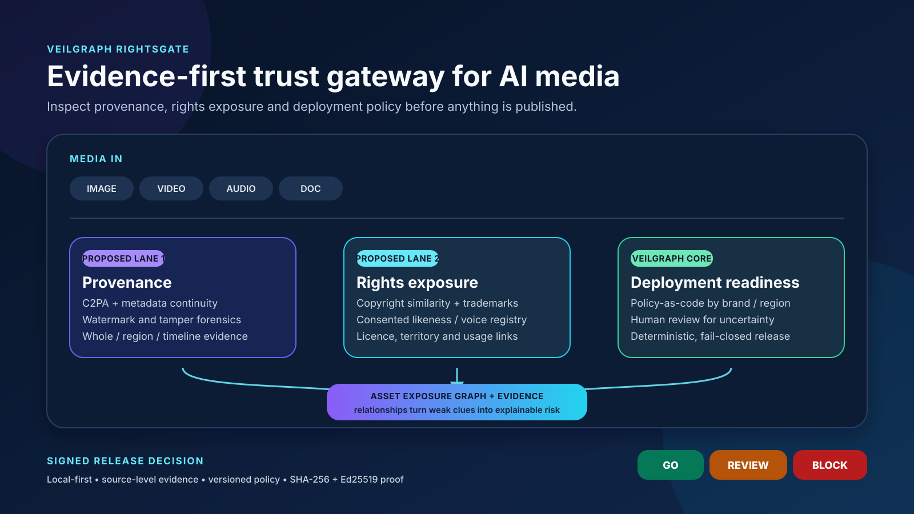

# VeilGraph RightsGate

**Evidence-first trust gateway for AI-generated and AI-assisted media.**

[](https://github.com/amogh-hub/VeilGraph-RightsGate/actions/workflows/ci.yml)

VeilGraph RightsGate is a challenge-focused product line derived from the frozen [VeilGraph](https://github.com/amogh-hub/VeilGraph) privacy-engineering system. The source repository remains unchanged. This repository targets the TECHgium challenge **“Safeguarding Content Rights in the Age of AI-Generated Media.”**

**Status:** `FOUNDATION VALIDATED` · `DOMAIN CONTRACT IMPLEMENTED` · `C2PA ADAPTER IMPLEMENTED` · `RIGHTS RETRIEVAL IMPLEMENTED` · `LICENCE/POLICY MODULES PLANNED`



## What exists today

The inherited VeilGraph foundation already provides:

- local-first processing for documents, images, structured data and video;
- a relationship-aware Identity Exposure Graph;
- configurable policy compilation;
- deterministic, fail-closed release decisions;
- adversarial output verification;
- cryptographically bound audit evidence and signed proof packages.

Those capabilities are inherited engineering assets, not evidence that the new challenge is already solved. AI-generation detection, provenance verification and rights-matching modules are explicitly planned work until their implementation and benchmark evidence land in this repository.

The implemented RightsGate boundary now includes strict, versioned `AssetIR`, assessment-request, evidence/claim, Asset Exposure Graph and three-dimension result schemas. Referential integrity, explicit abstention and fail-closed release invariants have automated tests.

The first provenance adapter uses the official CAI `c2pa-python` SDK in local-only mode. It reads and validates embedded Content Credentials, recognizes the IPTC declarations for AI-generated and AI-edited media, retains validation-status evidence, and distinguishes cryptographic mismatches from an untrusted signer. It is `IMPLEMENTED`, not yet `VALIDATED`: signed, tampered and transformed frozen fixture evaluation remains required before competition metrics are claimed.

The first rights adapter provides exact-byte and perceptual-image candidate retrieval against a versioned, content-addressed local registry. It applies EXIF orientation, enforces a pixel budget, fails closed on unsafe inputs and deliberately returns `UNKNOWN`—not “clear”—when no registered candidate is found. Similarity produces `POTENTIAL_EXPOSURE`, never a legal infringement conclusion. This adapter is also `IMPLEMENTED`, not benchmark-`VALIDATED`.

## Product contract

Every assessment must return three distinct, evidence-backed dimensions:

| Dimension | Required output |
|---|---|
| Provenance | Calibrated confidence, localized evidence and a conclusion of `SUPPORTED`, `CONTRADICTED` or `UNKNOWN` for generation and manipulation claims. |
| Rights exposure | Candidate work, mark, likeness or voice matches; source and usage constraints; confidence; and required human review. |
| Deployment readiness | A deterministic `GO`, `REVIEW` or `BLOCK` decision under a versioned brand, regulatory and regional policy. |

The system follows three strict claims rules:

1. Missing C2PA credentials or watermarks are `UNKNOWN`, never proof of human authorship.
2. Similarity is risk evidence, not a legal determination of infringement or ownership.
3. Missing mandatory evidence, detector failure or low confidence fails closed to `REVIEW` or `BLOCK`.

## Intended architecture

```text
Media asset + intended use + policy context
                 |
          Secure local ingestion
                 |
       +---------+---------+
       |                   |
Provenance lane       Rights lane
credentials,          works, marks,
watermarks,           likeness, voice,
forensics             licences
       +---------+---------+
                 |
        Asset Exposure Graph
                 |
       Versioned policy compiler
                 |
    Adversarial release verification
                 |
       GO / REVIEW / BLOCK
       + signed evidence pack
```

The Asset Exposure Graph will connect works, people, voices, marks, licences, transformations, territories, campaigns and intended uses. This lets RightsGate reason about combinations that isolated detectors cannot resolve—for example, a strong logo match paired with an expired licence in a restricted territory.

## Evidence-led development

Repository claims use these maturity labels:

- `PLANNED` — contracted but not implemented;
- `IMPLEMENTED` — code and automated tests exist;
- `VALIDATED` — frozen-set evaluation evidence exists;
- `RELEASED` — included in a signed tagged release.

Start with the engineering evidence:

- [Baseline and lineage](BASELINE.md)
- [Engineering plan](ENGINEERING_PLAN.md)
- [Challenge traceability](TECHGIUM_TRACEABILITY.md)
- [Evaluation protocol](EVALUATION_PROTOCOL.md)
- [Threat model](RIGHTSGATE_THREAT_MODEL.md)
- [Architecture decision records](docs/adr)
- [TECHgium abstract draft](competition/techgium10/ABSTRACT_DRAFT.md)

## Run the inherited foundation

Requirements: Python 3.11+, Node.js 22+, Tesseract OCR, Poppler and FFmpeg.

```bash
./scripts/setup_once.sh
./scripts/run_backend.sh
./scripts/run_frontend.sh
```

Backend tests:

```bash
cd backend
source .venv/bin/activate
PYTHONPATH=. pytest -q
```

Frontend checks:

```bash
cd frontend
npm run typecheck
npm run build
```

## Gate 1 contract API

The current API exposes schemas and validation/fingerprinting boundaries without pretending to run unfinished detectors:

```text
GET  /api/v1/rightsgate/contracts
POST /api/v1/rightsgate/requests/validate
POST /api/v1/rightsgate/assessments/validate
POST /api/v1/rightsgate/provenance/c2pa
```

Request validation is content-addressed: identical assessment inputs produce the same SHA-256 fingerprint regardless of the caller's idempotency key. Assessment validation enforces evidence, graph and `GO` invariants but deliberately returns `release_authorization: false`; only a later, trusted orchestration and policy boundary may authorize publication. The C2PA endpoint runs the implemented local credential adapter and returns a provenance fragment, never a release decision.

## Repository map

```text
backend/                    FastAPI engine, graph, policy, verification and proof
backend/app/rightsgate/     Versioned RightsGate contracts and validation API
backend/app/rightsgate/provenance/  Offline provenance adapters
backend/app/rightsgate/rights/      Governed local rights-reference adapters
frontend/                   React/Vite review and release interface
competition/techgium10/     Competition-specific narrative and evidence
docs/adr/                   Architecture decisions
scripts/                    Setup and local run helpers
```

## Claim boundaries

RightsGate does not make legal determinations, prove human authorship from missing metadata, promise detection of every generator, or replace qualified rights reviewers. Likeness and voice matching will be limited to an explicit, consented local reference registry. The system is a defensible decision-support and release-control layer whose evidence is designed to be inspected.

## Licence

Copyright © 2026 Amogh R B. All rights reserved. See [LICENSE](LICENSE).
